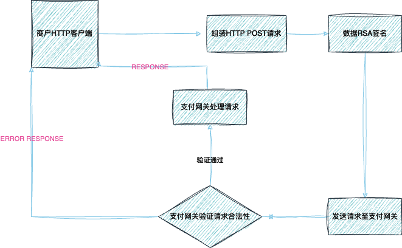

# 请求


# 一，商户请求流程图

# 二，请求示例
- 所有请求除`data`参数根据接口要求不同而不同，其它均相同，以下为充值请求示例

|参数|类型|描述|必须|
|:-------|:-------|:-------|:-------|
|app_id|int64| 商户唯一ID|是|
|api_key|string| 商户api_key|是|
|signature|string|参照 签名 章节 |是|
|data|object| JSON Object |是|
|data.identify|string| 用户唯一识别码 |是|

- CURL

```shell
curl --location 'https://payment.gateway/v1/recharge' \
--header 'Content-Type: application/json' \
--data '{
    "app_id": 1003,
    "api_key": "api_key",
    "sign":"mT9zuYkDgm1yOKni4/5uJyam63Vh6UM0Gm0XargzQgQ5ImLqe+QC0YwJkQrQzqn4K608ut2fLCvHd/C1bdhZteeyBuyEg3oafgEYaTMTiEZAxwdFMp1LWmlPArBAf/2G5l9WJMFGiZUaKYdvo16oodTq1FwQSxssYsmjmyGSRQw=",
    "data": {
        "identify": "88",
    }
}'
```

- 成功响应


 ```json
{
  "code": 8001,
  "data": {
    "address": "TWVcDxqTizpHccHTGCymysh9FYk1JA9b66"
	} 
}
 ```
|参数|类型| 描述                                                           |
|:-------|:-------|:-------------------------------------------------------------|
|code|int| 8001为成功，请参照 [全局错误码](../errcode/global_error_code.md "全局错误码") |
|data|object| 响应数据实体                                                       |
|data.address|string| 波场base58充值地址                                                 |


- 失败响应


 ```json
{
  "code": 8002
}
 ```
|参数| 类型  | 描述                                                             |
|:-------|:----|:---------------------------------------------------------------|
|code|int| 8002为系统错误，请参照 [全局错误码](../errcode/global_error_code.md "全局错误码") |

